# SecureAudit

KISA 취약점 점검 가이드(Unix U-01 - U-67, DBMS D-01 - D-26) 기반 **진단·조치 자동화 플랫폼**.
서버를 등록해두면 Ansible이 점검 스크립트를 배포·실행해 취약점을 진단하고, 자동조치가
가능한 항목은 바로 고칠 수 있다. 진단 결과는 고객사(프로젝트)별 MySQL DB에 쌓이고,
대시보드에서 조회하거나 엑셀/DOCX 보고서로 내려받을 수 있다. 

## 아키텍처

```mermaid
flowchart TD
    Admin[관리자] --> FE["대시보드<br/>React + TypeScript + Vite"]
    FE <-->|REST API| BE["백엔드<br/>FastAPI"]

    BE -->|진단 · 조치 · 서버관리 실행| ENGINE["자동화 엔진<br/>Ansible + Bash"]
    ENGINE -->|스크립트 배포 · 실행| TARGET["대상 서버들<br/>Rocky/Ubuntu + MySQL/PostgreSQL"]
    TARGET -->|결과 회수| ENGINE
    ENGINE --> REPORT["리포트 생성기<br/>Python"]
    REPORT -->|종합소견 요청| AI["AI 서비스<br/>Anthropic API"]
    REPORT -->|결과 저장| RESULTDB[("진단결과 DB<br/>audit_&lt;고객사&gt;")]

    BE <-->|조회 · 조치 반영| RESULTDB
    BE <-->|인증 · 설정| APPDB[("앱 DB<br/>secureaudit_app")]
    BE -->|알림 전송| NOTIFY["Slack Webhook"]
```



1. **서버 등록** — 대상 서버를 등록하면 자동화 엔진이 접속 권한(NOPASSWD sudo)을 설정하고 hostname/OS/DB 엔진을 감지한다.
2. **진단 실행** — Ansible이 점검 스크립트를 대상 서버에 배포·실행하고(OS 계정/파일/서비스 → DBMS 계정/접근/설정 순) 결과를 회수한다.
3. **리포트 생성** — 결과를 통합해 엑셀/문서를 만들고, AI로 종합소견을 생성한 뒤 진단결과 DB에 적재한다.
4. **조회/보고서** — 대시보드에서 결과를 조회하고 DOCX/CSV/JSON 보고서를 내려받는다.
5. **조치 실행** — 자동조치 가능한 항목만 실제로 변경하고 즉시 재진단한다.
6. **알림/인증** — 주요 이벤트는 Slack으로 알리고, 대시보드 접근은 세션 기반으로 인증한다.

## 폴더 구조

```
.
├── Ansible/          # 진단·조치 엔진 (KISA 가이드 판정 로직이 있는 유일한 곳)
│   ├── scripts/
│   │   ├── lib/          # 공통 엔진 - check_Uxx/fix_Uxx, check_Dxx/fix_Dxx 함수, 자동/수동 분류
│   │   ├── linux/        # U-01~U-67 항목별 실행 스크립트 (계정/파일/서비스/패치/로그)
│   │   ├── db/           # D-01~D-26 항목별 실행 스크립트 (계정/접근/옵션/패치, MySQL·PostgreSQL)
│   │   └── main_runner.sh
│   ├── 00_*.yml, 01_run_audit.yml   # 서버 등록/해제, 진단·조치 실행 플레이북
│   ├── 02_generate_report.py        # 결과 통합 → 엑셀/JSON + AI 종합소견
│   ├── 03_save_to_mysql.py          # 결과를 MySQL로 적재
│   └── hosts.ini                    # 대상 서버 인벤토리
├── backend/          # FastAPI 서버 - API, Ansible 실행 트리거, 보고서 생성, Slack 알림
├── frontend/         # React 대시보드 (로그인/서버등록/진단/결과/조치/보고서/설정)
├── DB/               # MySQL 스키마 정의 및 신규 고객사 DB 초기화 스크립트
└── Linux/            # Rocky/Ubuntu용 참고 자료 (현재 비어 있음)
```

## 기술 스택

| 영역 | 스택 |
|---|---|
| 프론트엔드 | React 19, TypeScript, Vite, Tailwind CSS 4 |
| 백엔드 | Python, FastAPI, Uvicorn, Pydantic 2 |
| 자동화 엔진 | Ansible, Bash |
| 데이터베이스 | MySQL 8.0 (PyMySQL) |
| 보고서 생성 | pandas, openpyxl(엑셀), python-docx(DOCX) |
| AI 종합소견 | Anthropic API (Claude) |
| 알림 | Slack Incoming Webhook |

## 데이터베이스

두 계층으로 분리되어 있다.

- **`secureaudit_app`** — 관리자 계정, 로그인 세션, 시스템 설정, 감사 로그. 앱 전역에 1개.
- **`audit_<고객사>_<연도>`** — 고객사(프로젝트)별 진단 결과 DB. `audit_scans`(스캔 회차) →
  `audit_hosts`(회차별 호스트, `host_facts`로 IP 기준 영구 이력 유지) → `audit_results`(세부 항목
  결과) 구조. 신규 고객사는 `DB/init_project_db.py`로 새로 생성한다.

## 진단 항목 커버리지

KISA 가이드 기준 Unix **U-01~U-67**, DBMS **D-01~D-26**을 다룬다. 각 항목은
`Ansible/scripts/lib/items.sh`에서 자동조치/수동확인 여부가 관리되며, 실제 판정·조치 로직은
`checks.sh`/`fixes.sh`(Unix), `db_checks.sh`/`db_fixes.sh`(DBMS, MySQL/PostgreSQL 분기)에
있다. 자세한 실행 구조와 개별 스크립트 사용법은 [`Ansible/README.md`](Ansible/README.md) 참고.

## 사전 준비

- Python 3.9+, Node.js + pnpm
- MySQL 8.0 (로컬 또는 접근 가능한 서버)
- Ansible (컨트롤 노드에 설치)
- 대상 서버와의 SSH 키 인증 (비밀번호 없는 접속)

## 설치

### 1. 환경 변수

레포 루트에 `.env` 파일을 만든다 (버전관리 대상 아님):

```bash
AUDIT_DB_HOST=localhost
AUDIT_DB_PORT=3306
DB_APP_USER=audit_user
DB_APP_PASSWORD=<MySQL 앱 계정 비밀번호>

AUDIT_DB_NAME=audit_autoever_2026   # 기존 진단 결과 DB
APP_DB_NAME=secureaudit_app         # 로그인/설정 DB
SESSION_TTL_SECONDS=1800

ANTHROPIC_API_KEY=                  # 선택 - 비워두면 AI 종합소견만 건너뜀
```

### 2. MySQL 준비

```bash
# secureaudit_app DB + 초기 관리자 계정 생성 (root 권한으로 1회)
mysql -u root -p < DB/init_app_db.sql

# 위 .env의 DB_APP_USER 계정을 생성하고 필요한 DB에 권한을 부여
mysql -u root -p -e "
  CREATE USER 'audit_user'@'%' IDENTIFIED BY '<비밀번호>';
  GRANT ALL PRIVILEGES ON secureaudit_app.* TO 'audit_user'@'%';
  GRANT ALL PRIVILEGES ON \`audit\_%\`.* TO 'audit_user'@'%';
  FLUSH PRIVILEGES;
"

# 고객사(프로젝트)별 진단결과 DB 생성
python3 DB/init_project_db.py <고객사명>
```

### 3. 백엔드

```bash
cd backend
python3 -m venv ../backend_venv
../backend_venv/bin/pip install -r requirements.txt
../backend_venv/bin/uvicorn main:app --host 0.0.0.0 --port 8000
```

### 4. 프론트엔드

```bash
cd frontend
pnpm install
pnpm run dev        # 개발 서버
# 또는
pnpm run build && pnpm run preview --host 0.0.0.0   # 빌드 후 프리뷰
```

### 5. Ansible

```bash
cd Ansible
# hosts.ini에 대상 서버(Tailscale IP 등) 등록 후
ansible-playbook 01_run_audit.yml                    # 전체 진단
ansible-playbook 01_run_audit.yml -e audit_mode=fix -l <host>   # 특정 서버 조치+재진단
```

서버 등록/초기 설정(NOPASSWD sudo 부여)은 평소 대시보드의 "서버 등록 → 초기 설정" 버튼이
대신 처리한다. 자세한 사전 준비(SSH 키 교환 등)와 개별 스크립트 디버깅 방법은
[`Ansible/README.md`](Ansible/README.md)에 있다.

`02_generate_report.py`/`03_save_to_mysql.py`는 백엔드와 별개로 컨트롤 노드의 system
python3에서 실행되므로, 의존 패키지도 따로 설치한다(`backend/requirements.txt`와는 무관):

```bash
pip install -r Ansible/requirements.txt
```

## 사용 흐름

1. 대시보드에 로그인
2. 서버 등록 → 초기 설정
3. 진단 실행 → 결과/보고서 확인
4. 취약 항목 조치 (자동조치 가능 항목만 실제 변경)
5. 필요 시 재진단으로 조치 결과 확인
